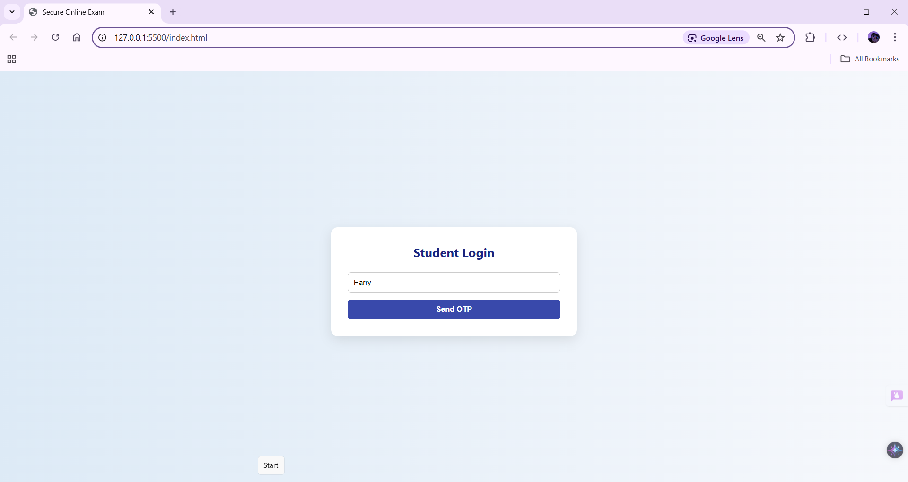
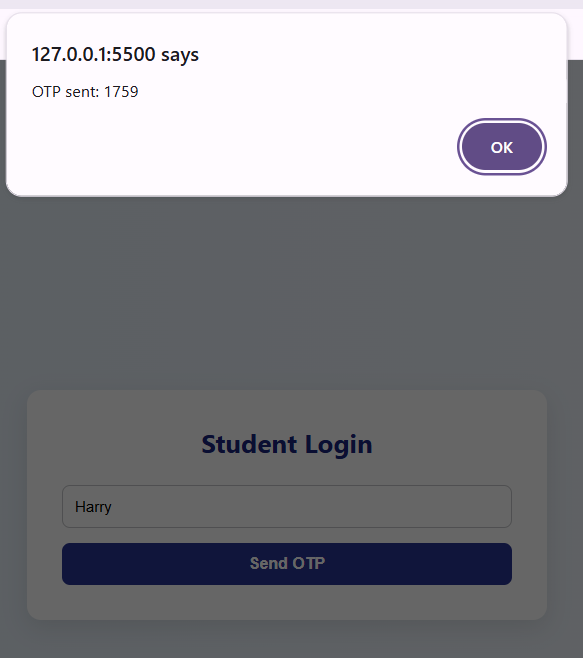
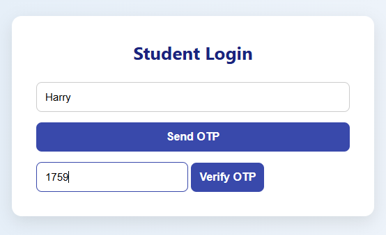
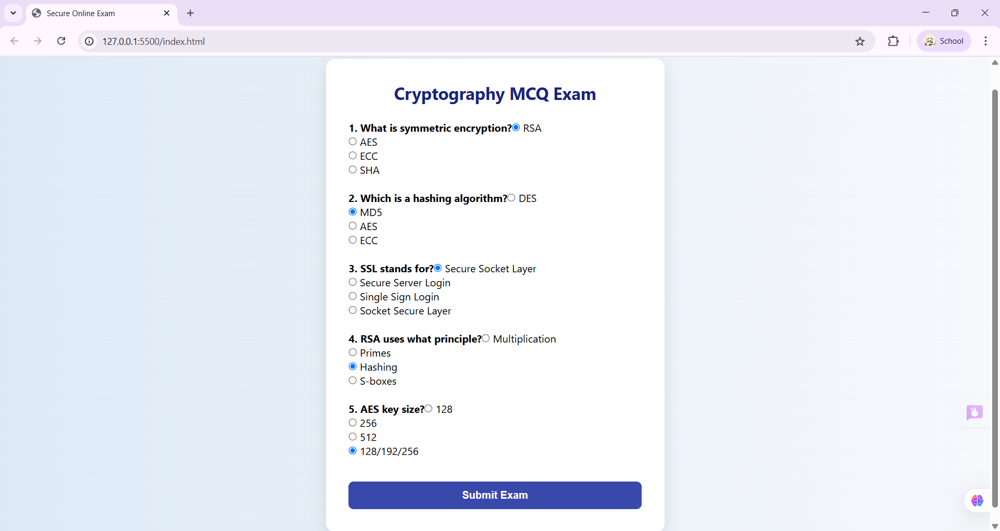
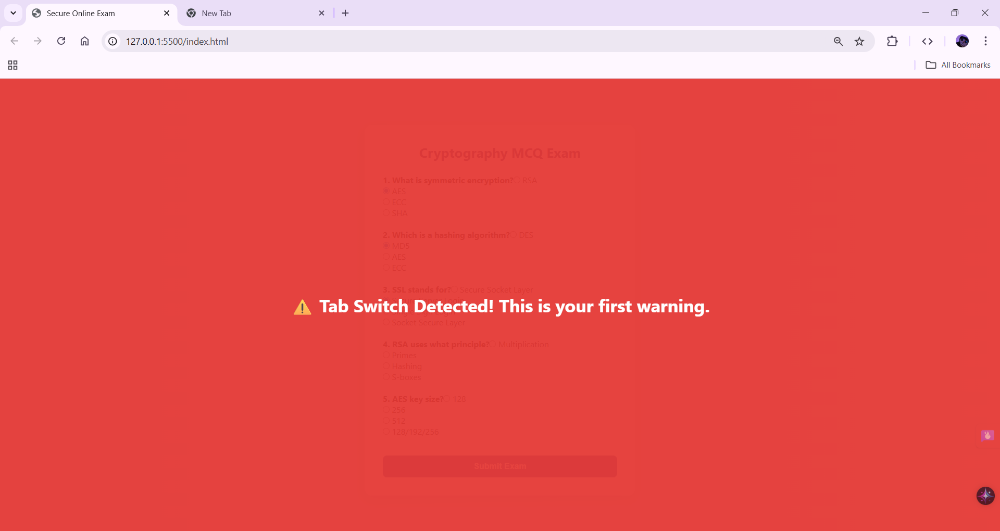
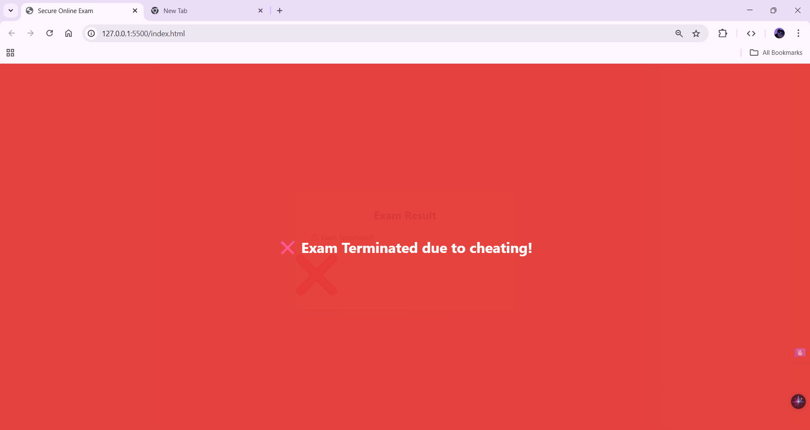
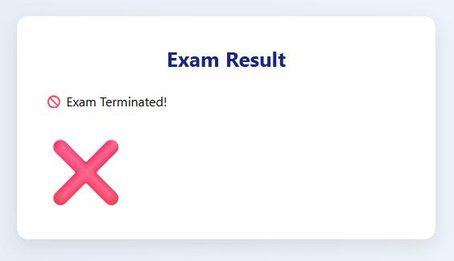

# Secure Online Exam

A **Secure Online Exam system** with **OTP login**, **MCQ tests**, and **anti-cheating features** built using **HTML, CSS, and JavaScript**.

---

## Features
- OTP-based login for secure access
- Multiple-choice question (MCQ) tests
- Anti-cheating mechanisms (tab switch detection, restrictions)
- Fully responsive and interactive frontend

---

## Technologies Used
- HTML, CSS, JavaScript
- Git & GitHub

---

## Screenshots

### 1. Login Page

### 2. OTP Authentication

### 3. OTP Verification

### 4. Exam Questions

### 5. Tab Switch Detection

### 6. Exam Rendering

### 7. Exam Result

---
## 🔗 Live Demo
[View Live Project](https://github.com/TanushriSV/secure-online-exam.git)
